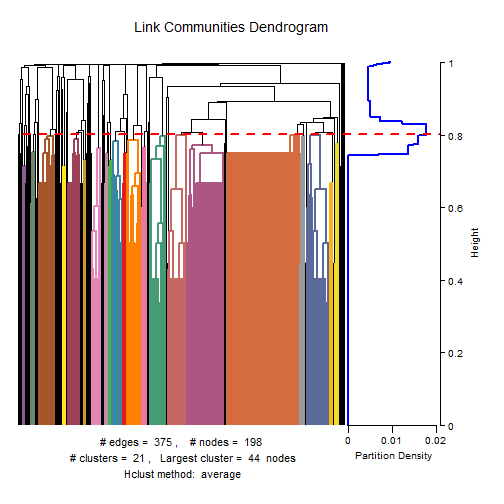
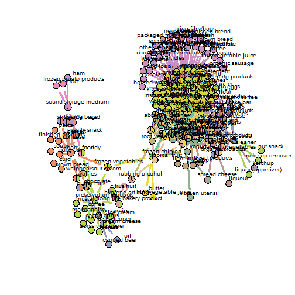

### Using Arules to provide edges
I begin this analysis by creating graph edges by infering an association between how one products purchase influences the purchase of another product.


```r
invisible(library("arules"))
```

```
## Loading required package: Matrix
## 
## Attaching package: 'arules'
## 
## The following objects are masked from 'package:base':
## 
##     %in%, write
```

```r
data(Groceries)
rules <- apriori(Groceries, parameter=list(support=0.00005, confidence=0.3 , maxlen = 2))
```

```
## 
## parameter specification:
##  confidence minval smax arem  aval originalSupport support minlen maxlen
##         0.3    0.1    1 none FALSE            TRUE   5e-05      1      2
##  target   ext
##   rules FALSE
## 
## algorithmic control:
##  filter tree heap memopt load sort verbose
##     0.1 TRUE TRUE  FALSE TRUE    2    TRUE
## 
## apriori - find association rules with the apriori algorithm
## version 4.21 (2004.05.09)        (c) 1996-2004   Christian Borgelt
## set item appearances ...[0 item(s)] done [0.00s].
## set transactions ...[169 item(s), 9835 transaction(s)] done [0.00s].
## sorting and recoding items ... [169 item(s)] done [0.00s].
## creating transaction tree ... done [0.00s].
## checking subsets of size 1 2 done [0.00s].
## writing ... [375 rule(s)] done [0.00s].
## creating S4 object  ... done [0.00s].
```

```r
rules
```

```
## set of 375 rules
```

```r
rulesDF<-as(rules, "data.frame")

rulesDF$lhs <- unlist(lapply(strsplit(gsub("\\}", "",gsub("\\{", "",(as.character(rulesDF$rules)))), "=>"), "[", 1))
rulesDF$rhs <- unlist(lapply(strsplit(gsub("\\}", "",gsub("\\{", "",(as.character(rulesDF$rules)))), "=>"), "[", 2))
rulesDF$lhs <- as.factor(rulesDF$lhs)
rulesDF$rhs <- as.factor(rulesDF$rhs)
```

--- .class #id 

### Link trimming
Lift is used as a metric to trim the dataset down to something much smaller.  This maintains only the most important relationships. 


```r
percentileParam<-quantile(rulesDF$lift, c(.75))
rulesDF_2 <-rulesDF[ which( rulesDF$lift > percentileParam), ]  
rulesDF_2<-rulesDF
```

--- .class #id 

### Building a graph
I load the data to a graph using the igraph package which is the system through which is the easiest way to temporarily persist the data before feeding to the linkcomm analysis.

```r
invisible(library("igraph"))
df.g <- graph.data.frame(d = data.frame(rulesDF_2$lhs,rulesDF_2$rhs), directed = FALSE)

#Graph for the graph
plot(df.g, vertex.label = V(df.g)$name)
```

 

--- .class #id 

### Running the analysis
At this stage the only thing left to do is to run the analysis.

```r
invisible(library("linkcomm"))
```

```
## Loading required package: RColorBrewer
## 
## Welcome to linkcomm version 1.0-11
## 
## For a step-by-step guide to using linkcomm functions:
##    > vignette(topic = "linkcomm", package = "linkcomm")
## To run an interactive demo:
##    > demo(topic = "linkcomm", package = "linkcomm")
## To cite, see:
##    > citation("linkcomm")
## NOTE: To use linkcomm, you require read and write permissions in the current directory (see: help("getwd"), help("setwd"))
```

```r
lc <- getLinkCommunities(data.frame(rulesDF_2$lhs,rulesDF_2$rhs) , hcmethod = "average" , directed = FALSE , verbose = FALSE)
```

 

--- .class #id 

### Printing the Graph
The final graph shows the location of the clusters using the reingold layout.


```r
invisible(plot(lc, type = "graph", layout = layout.fruchterman.reingold, verbose = FALSE))
```

 
